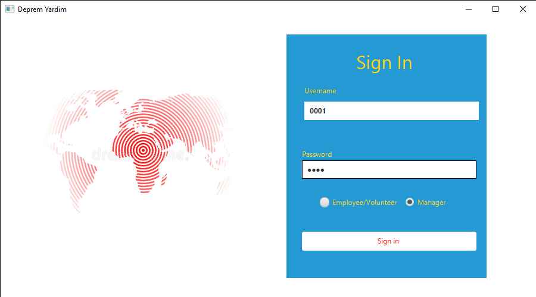
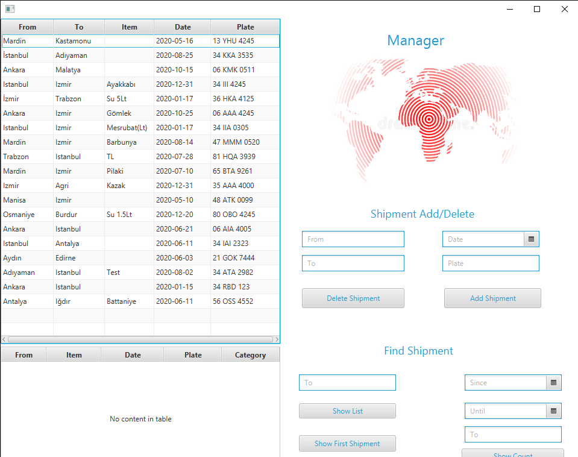
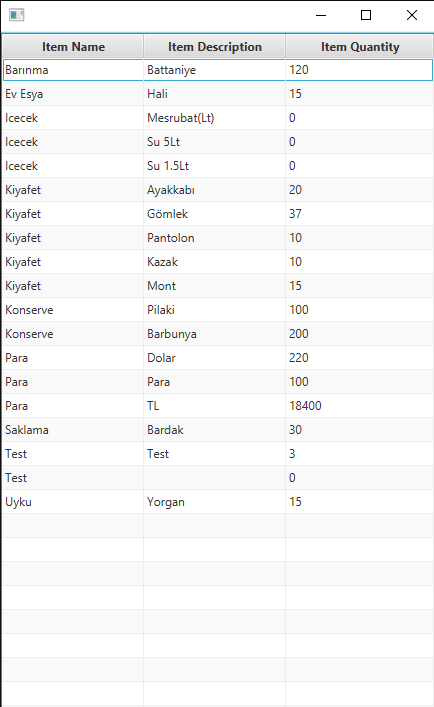
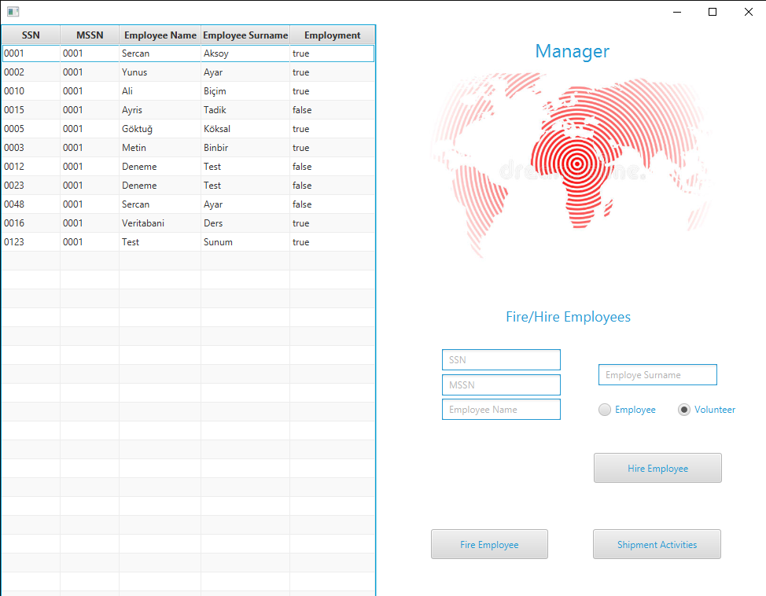
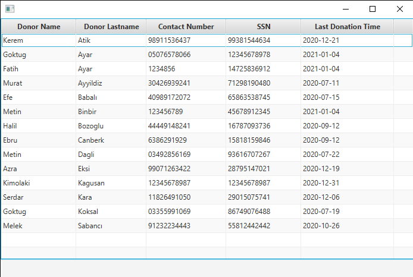
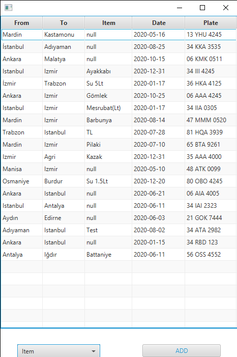

# Aid-Association-System
Goal of this project is designing a system for aid association  with JavaFX and a local database system with PostqreSQL

In this project,local database and all the sql queries created according to infos that we wanted from system interface created with PostqreSQL.
After Creating system interface using JavaFX and database using PostqreSQL ,gui and database connected.Employee can enter the system
with his log-in infos that is already defined in database.Also employee can add donor and create shipments for the association.Manager can enter the system with privileges
that can only be seen by the managers in interface such as fire/hire employee or find spesific shipments from shipments list

<a href="https://github.com/sercaksoy"> Sercan Aksoy </a>
<a href="https://github.com/metinbinbir"> Metin Binbir </a>

- Log-In Screen

-Shipments Activities Screen

-Items Screen

-Employee Fire/Hire Screen

-Donors Screen

-Shipments List

